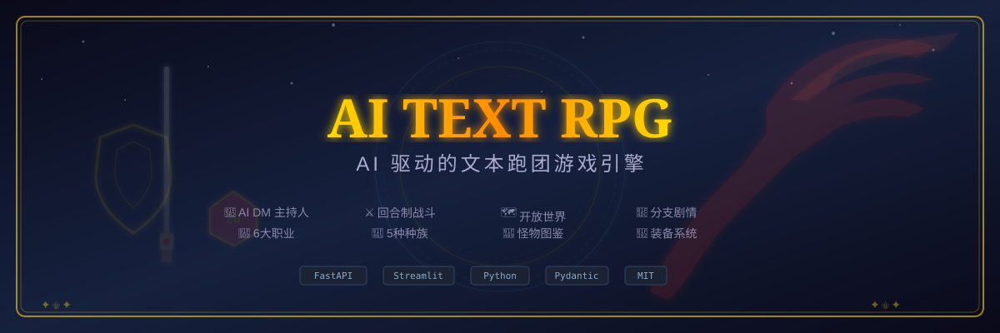

<div align="center">

# 🎲 AI Text RPG

**AI 驱动的文本跑团游戏引擎 — AI-Powered Text-Based RPG Engine**



[](LICENSE)
[](pyproject.toml)
[](https://fastapi.tiangolo.com)
[](https://streamlit.io)

</div>

---

## ✨ 项目介绍 / Introduction

**AI Text RPG** 是一个基于 LLM 的 AI 文本跑团游戏引擎，支持 AI 地下城主（DM）主持 + 玩家交互。

无论你是 **D&D 老玩家** 想要随时随地进行一场即兴冒险，还是 **桌游新手** 想体验角色扮演的乐趣，又或是 **AI 开发爱好者** 想研究 AI 游戏叙事系统——这个项目都适合你。

### 核心特色 / Core Features

| 特性 | 说明 |
|------|------|
| 🤖 **AI DM 主持人** | AI 自动推进剧情、描述场景、扮演 NPC、判定行动效果 |
| ⚔️ **回合制战斗** | 基于 D&D 5e 规则的完整战斗系统（先攻/命中/伤害/暴击/经验/掉落） |
| 🧙 **6 大职业** | 战士、法师、游侠、盗贼、牧师、武僧，各具特色技能树 |
| 👥 **5 种种族** | 人类、精灵、矮人、兽人、龙裔，各有种族加成 |
| 📜 **分支剧情** | 预设冒险剧本 + AI 动态生成叙事 |
| 🗺️ **开放世界** | 可探索多个区域，随机遭遇，天气与时间系统 |
| 🎒 **装备背包** | 武器/防具/饰品/药水/卷轴，完整的物品系统 |
| 🎲 **骰子系统** | 支持 d4/d6/d8/d10/d12/d20/d100 + 优势/劣势检定 |

### 技术栈 / Tech Stack

- **后端引擎**: Python 3.10+, FastAPI, Pydantic
- **前端面板**: Streamlit
- **架构**: 完全模块化，引擎与 API 分离
- **许可**: MIT 开源

---

## 🚀 快速开始 / Quick Start

### 安装 / Installation

```bash
# 克隆仓库
git clone https://github.com/c50346867/ai-text-rpg.git
cd ai-text-rpg

# 安装依赖
pip install -r requirements.txt

# 或使用 Poetry（推荐）
pip install poetry
poetry install
```

### 运行 / Run

```bash
# 方式一：Streamlit 前端交互面板（推荐）
streamlit run frontend/app.py

# 方式二：FastAPI 后端 API
uvicorn backend.api.main:app --reload

# 方式三：命令行快速体验
python examples/quick_start.py
```

### 运行测试 / Run Tests

```bash
pytest tests/ -v
```

---

## 🎮 玩法指南 / How to Play

### 基础操作 / Basic Controls

| 操作 | 说明 |
|------|------|
| ⬆️ **前进** | 进入新的场景或区域 |
| 🔍 **探索** | 搜索当前区域，可能发现隐藏物品或遭遇 |
| 💤 **休息** | 恢复生命值（长休恢复 50% HP）|
| 🗺️ **地图** | 查看已探索的区域 |
| 🎒 **查看背包** | 查看角色状态、属性、物品、装备 |
| 💬 **对话** | 与 NPC 交互，获取任务和信息 |
| ⚔️ **攻击** | 进入战斗后使用（可指定目标）|

### 属性系统 / Stats

遵循 D&D 5e 的六项基础属性体系：

| 属性 | 英文 | 核心作用 |
|------|------|----------|
| 💪 **力量** | Strength | 近战攻击、负重、运动 |
| 🏃 **敏捷** | Dexterity | 先攻、AC、远程攻击、潜行 |
| ❤️ **体质** | Constitution | HP、毒素抗性 |
| 📚 **智力** | Intelligence | 法师施法、奥秘知识 |
| 👁️ **感知** | Wisdom | 牧师施法、洞察、侦察 |
| 💬 **魅力** | Charisma | 社交交涉、威吓 |

### 战斗系统 / Combat System

- **先攻顺序**: 敏捷检定排序
- **攻击命中**: `d20 + 攻击加值 vs AC`
- **伤害计算**: 武器骰子 + 属性修正（暴击翻倍）
- **技能系统**: 各职业特殊技能（战士回气、武僧震慑拳等）
- **法术系统**: 法师/牧师/游侠可释放法术
- **战利品**: 击败敌人获得经验、金币和物品

---

## 📂 项目结构 / Project Structure

```
ai-text-rpg/
├── backend/                    # 后端引擎
│   ├── __init__.py
│   ├── engine/                 # 核心引擎模块
│   │   ├── __init__.py
│   │   ├── game_master.py      # AI DM 主持人引擎
│   │   ├── character.py        # 角色系统
│   │   ├── world.py            # 世界观管理器
│   │   ├── combat.py           # 战斗系统
│   │   └── story_generator.py  # 故事生成器
│   └── api/
│       ├── __init__.py
│       └── main.py             # FastAPI REST API
├── frontend/
│   ├── __init__.py
│   └── app.py                  # Streamlit 前端面板
├── data/                       # 游戏数据
│   ├── races.json              # 种族定义
│   ├── classes.json            # 职业定义
│   ├── monsters.json           # 怪物图鉴
│   ├── items.json              # 物品装备库
│   └── scenarios/              # 预设剧本
│       └── tutorial.json       # 新手教程
├── examples/                   # 示例
│   └── quick_start.py
├── docs/
│   └── banner.svg              # 项目横幅
├── tests/                      # 测试
│   ├── __init__.py
│   └── test_engine.py
├── pyproject.toml
├── requirements.txt
├── LICENSE                     # MIT
└── README.md                   # 本文件
```

---

## 🧩 核心模块说明 / Core Modules

### 🎯 Game Master (`game_master.py`)
- AI 地下城主核心，管理游戏状态机
- 处理玩家行动判定（DC 检定 + d20）
- 集成骰子系统（DiceRoller）
- 战斗初始化与管理

### 👤 Character (`character.py`)
- 六项属性 + 调整值计算
- 种族/职业系统
- 1-20 级升级系统
- 装备栏 + 背包系统
- 状态效果系统

### ⚔️ Combat (`combat.py`)
- 回合制战斗引擎
- 先攻顺序（敏捷判定）
- 命中/闪避/暴击/大失败
- 法术释放和豁免
- 经验值和战利品分配

### 🗺️ World (`world.py`)
- 多区域地图系统
- 地点探索和解锁
- 随机遭遇表
- 天气和时间系统

### 📜 Story Generator (`story_generator.py`)
- JSON 剧本加载器
- 分支剧情节点树
- 任务系统（主线/支线/随机）
- NPC 对话生成

---

## 🧪 扩展开发 / Extending

### 自定义剧本 / Custom Scenarios

在 `data/scenarios/` 下创建新的 JSON 文件：

```json
{
    "id": "my_adventure",
    "name": "我的冒险",
    "scenes": [
        {
            "id": "scene_001",
            "name": "起始村庄",
            "type": "exploration",
            "description": "一个宁静的小村庄...",
            "choices": [
                {"text": "前往森林", "next_scene": "scene_002"}
            ]
        }
    ]
}
```

### 集成真实 LLM / Real LLM Integration

继承 `StoryGenerator` 类并重写文本生成方法：

```python
class MyLLMStoryGenerator(StoryGenerator):
    def generate_scene_description(self, context, location, time):
        # 调用 OpenAI / Anthropic / 本地模型 API
        response = openai_client.chat.completions.create(...)
        return response.choices[0].message.content
```

### API 文档 / API Docs

启动 FastAPI 后端后访问：
- Swagger UI: `http://localhost:8000/docs`
- ReDoc: `http://localhost:8000/redoc`

---

## 📜 许可 / License

**MIT License** — 完全开源，可以自由使用、修改和分发。

详情见 [LICENSE](LICENSE)。

---

## 🙏 致谢 / Acknowledgments

- 灵感来自 **Dungeons & Dragons** 5e 规则
- 前端基于 **[Streamlit](https://streamlit.io)** 开发
- API 框架使用 **[FastAPI](https://fastapi.tiangolo.com)**

---

<div align="center">

**Made with 🎲 by [c50346867](https://github.com/c50346867)**

⭐ 如果喜欢这个项目，欢迎 Star！ ⭐

</div>
